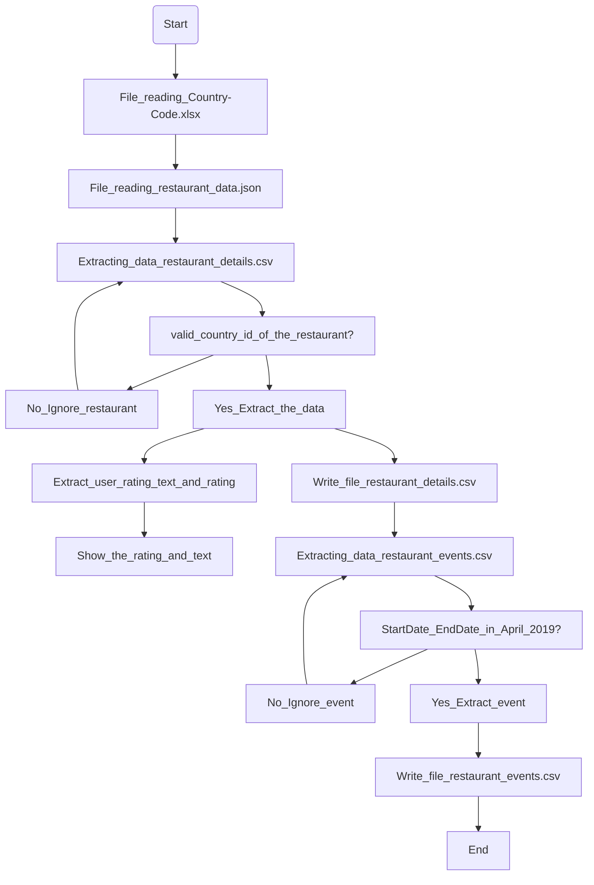

# Data-engineering-exercise

## Installation of modules
Steps:
1) Run `pip install -r requirements.txt`
2) Run the python file `main.py`

## Short summary on how to design/deploy using cloud services and any decisions you made when designing solution
I would deploy this code by establishing an `SSH connection` with the cloud services before running `pip install requirements.txt` and executing the code using the cloud services terminal by running `python3 main.py`. 

When designing the solution, I initially explored the data and realized that the JSON file provided was extremely nested hence prompting me to do a draft to explore all the JSON data fully. When it came to file reading, a conventional approach like using the `CSV` module or `open` function did not work as it was an `XLSX` file type (Excel), resulting in my usage of the `pandas` module to read the Excel file. Since we are forced to use the `pandas` module, I made full use of the `pandas` module to read and the `pandas.json_normalize` function to normalize the data so that the JSON file is flattened, reducing the number of iterations needed. Additionally, I also realized that one restaurant can potentially have more than one event, and one event potentially having more than one photo link to it. 

With all this in mind, for us to get all the data needed, this solution is optimized as far as possible with the time complexity of `O(n^2)`

## Architecture Diagram
Simplified version of the code architecture

